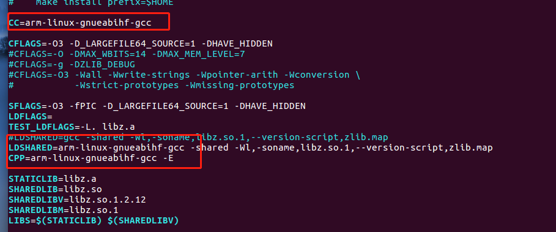
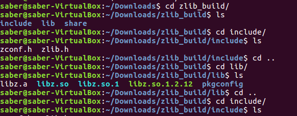

下载Zlib

<!-- more -->


**1.下载Zlib**

```
wget  http://www.zlib.net/zlib-1.2.12.tar.gz
```


**2.解压安装包**

```
tar -zxvf zlib-1.2.12.tar.gz
```


**3.配置编译程序存放路径**

```
./configure --prefix=/home/saber/Downloads/zlib_build/
```


**4. 修改链接库,配置交叉编译工具**




**5.安装**

```
sudo make & make install
```


**6.检查编译结果**




**二、下载安装UnZip**


```
wget https://sourceforge.net/projects/infozip/files/UnZip%206.x%20%28latest%29/UnZip%206.0/unzip60.tar.gz
```

安装

```
./unix/configure
cp ./unix/Makefile .
make
make generic
make install
```


