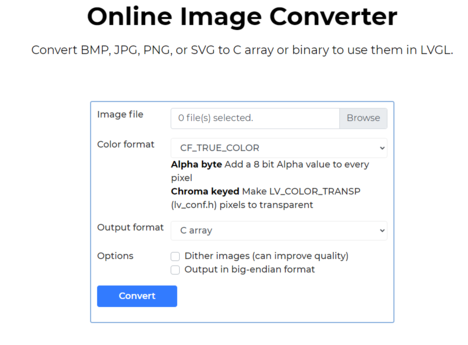
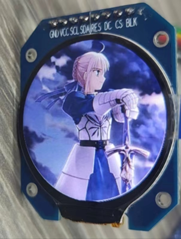

## esp32c3基于lvgl的图像显示

<!--more-->

软件环境：

Vscode、ESP_IDF

硬件环境：

ESP32C3、GC9A01


**基于spi_lcd_touch示例项目工程开发**

配置menuconfig-----> Example Configuration-----> LCD controller model (GC9A01)

使用[调整图像大小](https://www.iloveimg.com/zh-cn/resize-image#resize-options,pixels)工具，调整图像高度和宽度。

使用LVGL 提供的 Online Image Converter  工具，将图片转换成数组。




```c
  LV_IMG_DECLARE(saber_1);

  lv_obj_t *img1 = lv_img_create(lv_scr_act());
  lv_img_set_src(img1, &saber_1);
  lv_obj_align(img1, LV_ALIGN_CENTER, 0, 0);
  lv_obj_set_size(img1, 240, 240);
```

图像显示效果




### 参考资料

[LVGL 文档](https://docs.lvgl.io/8.3/libs/sjpg.html#example)

[调整图像大小](https://www.iloveimg.com/zh-cn/resize-image#resize-options,pixels)

[Convert BMP, JPG, PNG, or SVG to C array or binary to use them in LVGL](https://lvgl.io/tools/imageconverter)

